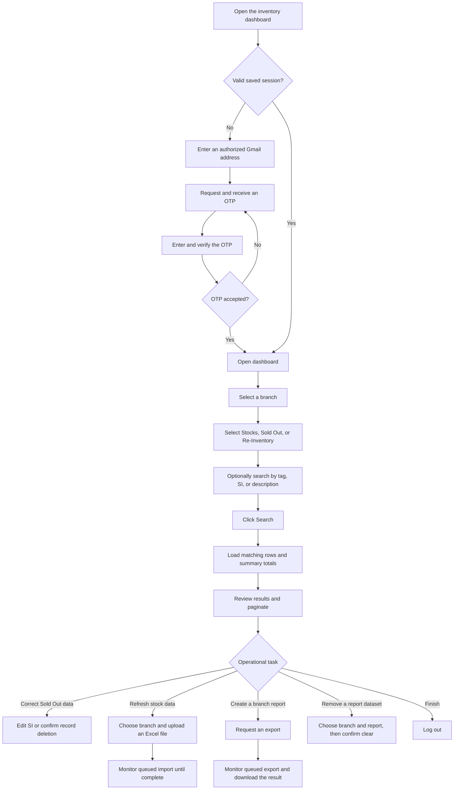
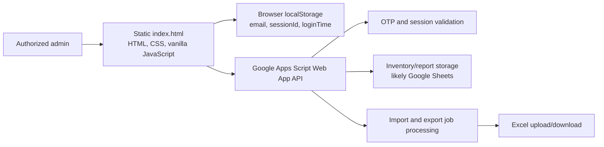

# Legacy Acebedo Optical Inventory Dashboard

> This document records the behavior of the original single-file application.
> The preserved source is now [`legacy/index.html`](./legacy/index.html). See
> [`docs/README.md`](./docs/README.md) for the React and Supabase replacement.

## What this app is for

This is a single-page administration dashboard for Acebedo Optical's central
inventory operation. It gives authorized staff one place to inspect and
maintain inventory records for these branches:

- `GAI` — Gaisano Iloilo
- `CAS` — Casa Plaza
- `BAC` — Bacolod

The app groups records into three operational reports:

| UI label | Internal name | Meaning |
| --- | --- | --- |
| Stocks | `stocks` | Inventory currently available |
| Sold Out | `SCANRESULTS` | Items recorded as sold; these records can have their SI corrected or be deleted |
| Re-Inventory | `AUDIT` | Items counted again during an audit |

The likely primary user is an inventory administrator or operations staff
member. The dashboard is intended to answer: what is available, sold, or
audited at each branch; where is a particular tagged item; and what inventory
data needs to be imported, corrected, cleared, or exported?

## Happy flow



Branch and report selection do not automatically load data. The user must click
**Search** or **Refresh**. Results are displayed 20 rows at a time.

## Main capabilities

### Authentication

1. The user enters a Gmail address.
2. The backend checks authorization and sends an OTP.
3. Successful OTP verification returns a session ID.
4. The browser stores the email, session ID, and login time in `localStorage`.
5. A saved session is checked with the backend whenever the app opens.
6. The client treats the login as expired after 13 hours.
7. Logout invalidates the remote session and removes the local session.

There is one visible administrator experience and no client-side role model.
Authorization rules live in the backend, which is not included in this
repository.

### Search and review

The dashboard sends the selected branch, report, and free-text search to the
backend. A successful response supplies:

- Matching inventory rows
- Total available items
- Total sold-out items
- Total audited items

Each displayed row contains:

```text
branch, lenstype, description, tag, si, date, row
```

`row` is the backend record position used when updating or deleting a record.
Edit and Delete actions are exposed only while viewing the Sold Out report.

### Update stocks

The user selects a branch and an `.xlsx` or `.xls` file. The browser converts
the file to Base64 and posts it to the backend. The backend can accept the
upload immediately or return a queued job. For queued work, the UI polls every
three seconds and shows Pending, Running, Done, or Failed.

### Export

The user selects a branch and requests an export. The backend returns a queued
job ID. The UI polls for completion, then starts a browser download from the
result URL.

### Clear a report

The user selects a branch and one of the three reports, then confirms a
destructive clear operation. The backend performs the deletion. This action is
not described as reversible in the UI.

## Technical architecture



The repository contains only `index.html`. There is no framework, build step,
client router, or bundled backend. UI state is held in DOM controls plus three
JavaScript variables:

- `allRows` — current result set
- `currentPage` — selected result page
- `rowsPerPage` — fixed at 20

All authentication, storage, report aggregation, import, export, and job
processing are delegated to one deployed Google Apps Script endpoint. Google
Sheets is a reasonable inference from the report names and row-based API, but
cannot be confirmed without the backend source.

### Backend actions used

| Action | Method | Purpose |
| --- | --- | --- |
| `sendOTP` | GET | Authorize an email and send an OTP |
| `verifyOTP` | GET | Verify OTP and create a session |
| `checkSession` | GET | Validate a saved session |
| `logout` | GET | Invalidate a session |
| `summary` | GET | Fetch filtered rows and totals |
| `updateSI` | GET | Correct a Sold Out SI value |
| `deleteRecord` | GET | Delete an individual record |
| `clearSheet` | GET | Clear a branch report |
| `export` | GET | Queue a branch export |
| `uploadStock` | POST | Upload a Base64-encoded Excel file |
| `getJobStatus` | GET | Poll an import or export job |

## Important implementation notes

- The Google Apps Script backend is external, so its authorization, validation,
  persistence, backup, and concurrency behavior cannot be audited here.
- Session credentials are appended to many request URLs. URLs can appear in
  browser history, proxy logs, and server logs; authenticated actions would be
  safer with credentials in headers or POST bodies.
- API data is interpolated into `innerHTML` and inline `onclick` attributes
  without visible escaping. Untrusted inventory values could create an
  injection risk.
- Destructive changes use GET requests. `deleteRecord`, `clearSheet`, and
  updates should preferably use state-changing HTTP methods with server-side
  CSRF protection and strict authorization.
- Import/export polling has no maximum duration or backoff, so a stuck job can
  poll indefinitely.
- Error feedback is inconsistent: some failures are logged only to the browser
  console instead of being shown to the user.
- The external SheetJS script is loaded, but the current upload path does not
  use it; files are sent as raw Base64.

## Source map

All legacy implementation is in [`legacy/index.html`](./legacy/index.html):

- Login screen and dashboard layout: lines 299–505
- Authentication and session lifecycle: lines 539–837
- Search, totals, table, and pagination: lines 849–1379
- Clear, export, and stock upload: lines 1388–1630
- Background job polling: lines 1656–1894
- Edit, dialog, export, upload, and clear modals: lines 1907–2182
