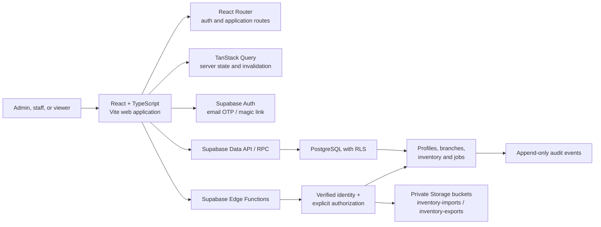
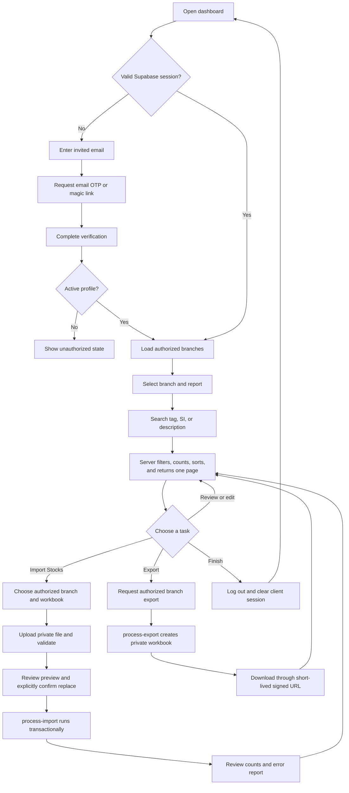

# Architecture and application flows

## System architecture

The browser is an untrusted client. It uses the public Supabase URL and anon
key; PostgreSQL Row-Level Security (RLS) controls direct data access. Operations
that need elevated database or Storage access are handled by Edge Functions,
which verify the caller and re-check the caller's role and branch access before
using server-only credentials.

No service-role key may be bundled into the web application. Hiding a button is
only a usability measure; RLS and server-side checks remain authoritative.

## Component boundaries

The implementation is organized by responsibility:

- `app` owns providers, routing, and application bootstrap.
- `pages` compose route-level experiences.
- `components` contains reusable auth, dashboard, inventory, dialog, job,
  layout, and primitive UI pieces.
- `features` owns domain queries and mutations for authentication, inventory,
  imports, exports, and administration.
- `lib/supabase` creates the browser client and common database helpers.
- `lib/validation` contains form and input schemas.
- `services` wraps Supabase queries, RPC calls, Storage, and Edge Functions.
- `types` contains application/domain types.
- `utils` contains non-domain helpers.

Presentation components must not contain service-role logic or make
authorization decisions. Query and mutation code should use stable IDs and
invalidate only affected queries after a successful mutation.

## Happy path

## Authentication and session lifecycle

1. The user enters an email address.
2. Supabase Auth sends a magic link or email OTP. Public self-registration is
   disabled or invite-only in production.
3. The verification redirect returns to an allowed application URL.
4. The Supabase browser client establishes a session and refreshes it according
   to the project's JWT/session configuration.
5. An authentication guard waits for initial session restoration before
   choosing between the sign-in and protected routes.
6. The application loads `profiles` and branch access. An inactive or missing
   profile is denied even when the Auth session itself is valid.
7. RLS applies the same role and branch rules to every database request.
8. Logout calls Supabase Auth sign-out, clears query caches and sensitive
   in-memory state, and returns to sign-in.

The browser may persist the Supabase session using the SDK's supported storage
mechanism. Application code must not invent a second session token, put tokens
in query strings, or log tokens. JWT lifetime, refresh-token reuse detection,
and session limits are production project settings and must be reviewed before
cutover.

Email-request responses should be neutral so the sign-in form does not reveal
whether an arbitrary email is registered. Expired and consumed links should
return the user to sign-in with a clear recovery action.

## Inventory query lifecycle

The active branch, report, search term, page, page size, and sort are part of
the query key. The server:

1. validates the inputs;
2. applies RLS to the caller;
3. filters by branch and report;
4. searches tag, SI, and description using parameterized queries;
5. excludes archived records;
6. calculates totals with a documented scope; and
7. returns one sorted page and total result count.

The UI defaults to all branches the caller is authorized to access and labels
that scope. Selecting a branch narrows the rows and totals to that branch.

## Trust boundaries

- **Browser:** public configuration only; all values are untrusted.
- **Data API:** protected by grants, constraints, and RLS.
- **Edge Functions:** validate bearer token, active profile, role, branch
  access, input size, file type, and operation-specific permissions.
- **Storage:** both buckets are private. Download access is via short-lived
  signed URLs created after authorization.
- **Audit:** ordinary application users cannot update or delete audit events.
