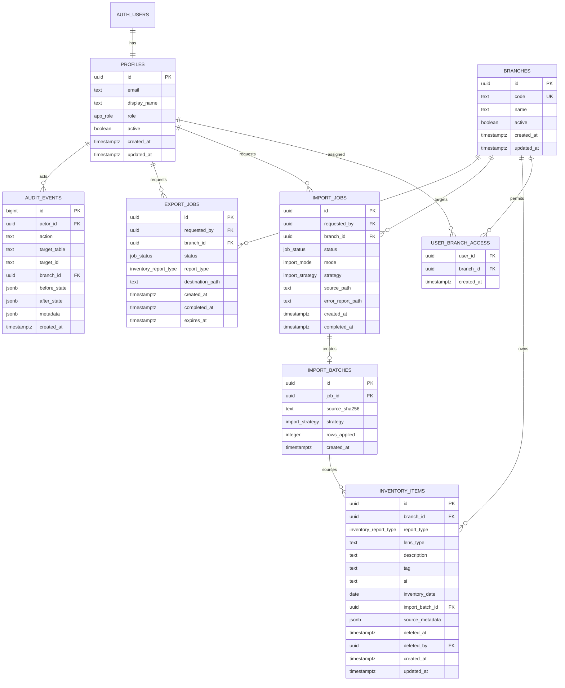

# Data model and authorization

## Modeling decision

Stocks, Sold Out, and Re-Inventory are stored in one `inventory_items` table
with a constrained `report_type`. A unified table gives all records stable
identifiers, common validation and indexes, consistent branch isolation, and a
single place to apply audit and archival rules. `import_batch_id` and source
metadata preserve provenance.

Report membership is the current operational classification, not a complete
item lifecycle event stream. Sensitive changes are preserved separately in
`audit_events`. If the business later needs an immutable movement ledger, add
an event table rather than overloading `report_type`.

## Logical schema

The diagram is a logical contract. Migration files are authoritative for exact
column names, optional fields, defaults, and enum members.

## Constraints and indexes

Expected safeguards include:

- `profiles.id` references `auth.users(id)` and new profiles default to a
  non-administrative role and inactive or least-privileged state.
- `branches.code` is unique and constrained to a stable code.
- `(user_id, branch_id)` is the primary or unique key for branch assignments.
- `inventory_items.report_type` uses the `inventory_report_type` enum:
  `stocks`, `sold_out`, or `audit`.
- Archive fields are internally consistent; archival records are omitted from
  normal reads.
- Job states use the constrained set `pending`, `running`, `completed`,
  `completed_with_errors`, `failed`, or `cancelled`; timestamps/counts cannot
  be nonsensical.
- Foreign keys prevent orphaned branch, profile, job, and batch references.
- Indexes support active inventory by `(branch_id, report_type)`, tag, SI,
  inventory date, import batch, job requester/status, and audit branch/time.
- Description search uses an appropriate text index if dataset size warrants
  it. Query plans must be reviewed using production-like volumes.

The legacy spreadsheet row number is stored only as optional source metadata,
never used as a key.

## Roles and permissions

Branch assignment applies to `staff` and `viewer`. `admin` has cross-branch
access, including future active branches, but privileged actions still pass
explicit server checks.

| Capability | Admin | Staff | Viewer |
| --- | :---: | :---: | :---: |
| Sign in when profile is active | Yes | Yes | Yes |
| View/search assigned branches | All branches | Assigned only | Assigned only |
| View summary totals | All/selected scope | Assigned only | Assigned only |
| Edit permitted Sold Out SI | Yes | Yes, assigned branch | No |
| Archive an individual record | Yes | No | No |
| Upload Stocks workbook | Yes | No | No |
| Export reports | Yes | Yes, assigned branch | No |
| Clear/archive a report | Yes | No | No |
| View own jobs | Yes | Yes | No unless needed |
| View all audit events | Yes | No | No |
| Manage users, roles, assignments | Yes | No | No |

Assigned staff can export and correct SI. Import, record archive, report clear,
and user administration are admin-only in the UI, Storage policies, privileged
database functions, and Edge Functions.

## RLS policy intent

RLS is enabled on every application table exposed through Supabase.

- Every policy requires an authenticated user whose `profiles.active` is true.
- Inventory `SELECT` permits admins or users assigned to the row's branch.
- Inventory `UPDATE` permits admins and, for the approved operational fields,
  assigned staff. A privileged function or column-level grant prevents users
  from modifying branch, role-sensitive provenance, and archive fields.
- Viewers have no insert, update, or delete policy.
- Profiles are readable only as required. Users cannot update their own role,
  active flag, or branch assignments.
- Branch-assignment writes and user administration are privileged/admin-only.
- The `admin_update_user` RPC changes another user's role, active state, and
  complete branch assignment set in one operation and audits it. It rejects an
  administrator changing their own role/active state, preventing accidental
  self-lockout and requiring a second administrator for that change.
- Direct authorization changes through `profiles` or
  `user_branch_access` are blocked; the audited RPC is the supported
  administration path after first-admin bootstrap.
- Job reads are limited to the requester and authorized admins; creation and
  state transitions are operation-specific.
- Audit events are inserted by trusted functions and are immutable to ordinary
  users.
- Storage object paths and policies bind files to authorized jobs/branches.

Security-definer database functions, if used, must set a safe `search_path`,
fully qualify objects, validate `auth.uid()`, and be executable only by the
minimum required roles. A service-role call does not bypass the need for an
explicit authorization check in an Edge Function.

## Audit contract

Sensitive operations create an audit event containing:

- acting user;
- action name;
- target type and stable target ID;
- branch;
- before state when applicable;
- after state when applicable;
- timestamp; and
- job, import batch, affected-row count, or request correlation metadata.

At minimum this applies to SI edits, record archival/recovery, import apply,
report clear/recovery, export generation, role changes, and branch-assignment
changes. Audit entries must exclude access tokens, service keys, magic links,
and unnecessary workbook contents.

## Record retention and deletion

User-facing “Delete” and “Clear report” are implemented as archival by setting
archive metadata in a server-controlled transaction. Archived rows are hidden
from normal results but remain available for an authorized recovery. Physical
purge is a separate retention operation requiring a documented retention
period, backup verification, and explicit production approval.
